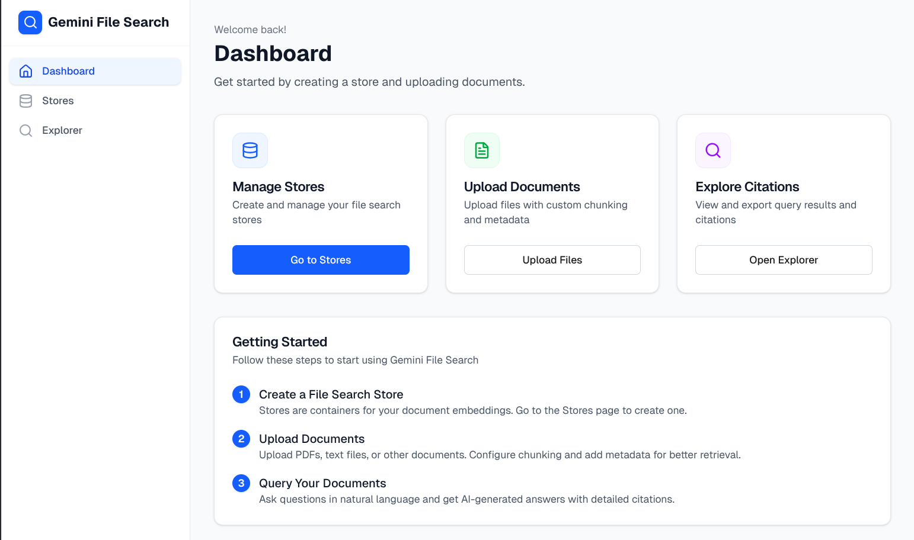
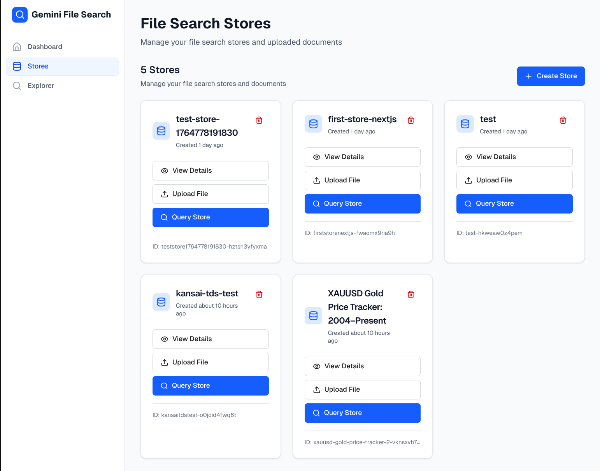
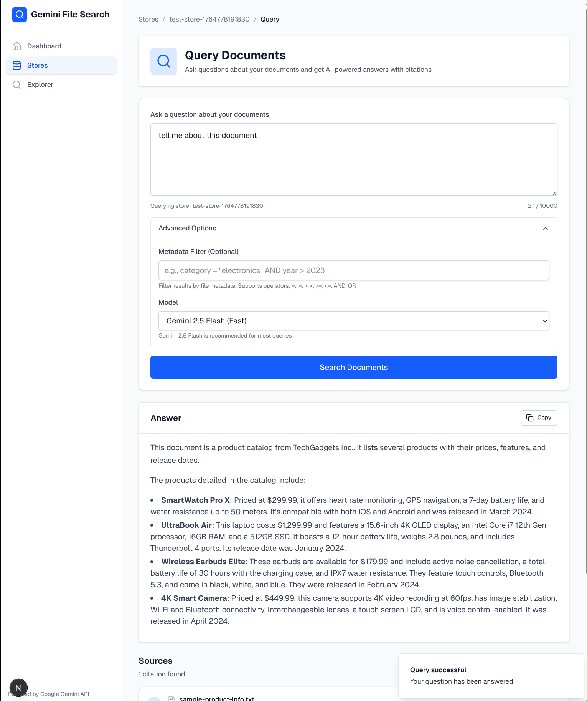

# Gemini File Search - Next.js Frontend

A modern web application for exploring Google's Gemini File Search API with RAG (Retrieval Augmented Generation) capabilities.

## Screenshots

<table>
  <tr>
    <td width="50%">
      <h3 align="center">Dashboard</h3>
      
    </td>
    <td width="50%">
      <h3 align="center">Store Management</h3>
      
    </td>
  </tr>
  <tr>
    <td width="50%">
      <h3 align="center">Query Interface</h3>
      
    </td>
    <td width="50%">
      <h3 align="center">Landing Page</h3>
      
    </td>
  </tr>
</table>

## Features

- **File Search Store Management** - Create and manage document stores
- **Document Management** - View and delete uploaded files with metadata display
- **File Upload** - Upload documents with custom chunking and metadata
- **Semantic Search** - Query documents with AI-powered search
- **Citation Explorer** - View detailed source citations and grounding metadata
- **Advanced Filtering** - Filter results by metadata
- **Multi-Store Queries** - Search across multiple document stores

## Tech Stack

- **Framework:** Next.js 16 (App Router)
- **Language:** TypeScript
- **Styling:** Tailwind CSS 4
- **UI Components:** Radix UI
- **Forms:** React Hook Form + Zod
- **API:** Google Gemini AI (`@google/genai`)

## Prerequisites

- Node.js 20+
- npm
- Gemini API key ([Get one here](https://aistudio.google.com/apikey))

### ⚠️ Important: API Key Tiers

**Model availability depends on your API key tier:**

- **Free Tier** ✅: Can use Gemini 2.5 Flash, Pro, and Flash Lite
- **Paid Tier** 💳: Can use all models including Gemini 3 Pro Preview

If you use a free tier API key, some advanced models (like Gemini 3 Pro Preview) will show an error. The application will clearly indicate which models require a paid API key in the query interface.

See the [User Guide](docs/USER_GUIDE.md#model-selection) for detailed information about models and rate limits.

## Getting Started

### 1. Clone and Install

```bash
# Clone the repository
git clone https://github.com/sherajdev/gemini-file-search-lesson.git
cd gemini-file-search-lesson

# Install dependencies
npm install
```

### 2. Configure Environment

Create a `.env.local` file in the root directory:

```bash
# Copy the example file
cp .env.example .env.local

# Add your API key
GEMINI_API_KEY=your-api-key-here
```

### 3. Run Development Server

```bash
npm run dev
```

Open [http://localhost:3000](http://localhost:3000) in your browser.

## 📖 User Guide

For detailed instructions on using the application, see the **[Complete User Guide](docs/USER_GUIDE.md)**.

The guide covers:
- Creating and managing stores
- Uploading files with chunking and metadata
- Querying documents with AI-powered search
- Understanding citations and grounding
- Advanced features (multi-store queries, metadata filtering, model selection)
- Troubleshooting and best practices

## Project Structure

```
gemini-file-search-lesson/
├── app/                    # Next.js App Router
│   ├── api/               # API routes (server-side)
│   ├── (dashboard)/       # Dashboard pages
│   └── page.tsx           # Landing page
├── components/            # React components
│   ├── ui/               # Base UI components
│   ├── stores/           # Store management
│   ├── upload/           # File upload
│   ├── query/            # Query interface
│   └── explorer/         # Citation explorer
├── lib/                   # Backend logic and utilities
│   ├── api/              # Gemini API wrappers
│   ├── hooks/            # Custom React hooks
│   ├── types/            # TypeScript types
│   └── utils/            # Utility functions
├── data/                  # Sample test files
├── legacy/                # Original CLI examples
└── features/              # Feature planning docs
```

## Project Status

This project is **100% complete** and production-ready with:
- ✅ Full-featured Next.js web application
- ✅ Comprehensive store and document management
- ✅ Advanced file upload with chunking and metadata
- ✅ AI-powered semantic search with citations
- ✅ Responsive design and accessibility features
- ✅ Complete documentation and user guides

## Scripts

```bash
# Development
npm run dev          # Start dev server
npm run build        # Build for production
npm run start        # Start production server

# Code Quality
npm run lint         # Run ESLint
npm run type-check   # TypeScript type checking
```

## API Routes

✅ **All API endpoints are now implemented and functional:**

### Store Management
- `GET /api/stores` - List all file search stores
- `POST /api/stores` - Create a new store
- `GET /api/stores/[storeId]` - Get store details
- `DELETE /api/stores/[storeId]` - Delete a store

### Document Management
- `GET /api/stores/[storeId]/documents` - List all documents in a store
- `DELETE /api/stores/[storeId]/documents/[documentId]` - Delete a document

### File Upload & Queries
- `POST /api/stores/[storeId]/upload` - Upload file to store with chunking & metadata
- `POST /api/queries` - Query stores with AI-powered retrieval and citations
- `GET /api/operations/[operationId]` - Check operation status for async operations

All routes include:
- Zod validation for request payloads
- Comprehensive error handling
- TypeScript type safety
- Proper Next.js 15+ async params pattern

## Legacy CLI Examples

The original Node.js CLI scripts are preserved in the `legacy/` directory:

```bash
# Run legacy examples
node legacy/examples/test-file-search.js
node legacy/examples/advanced-examples.js

# Clean up test stores
node legacy/scripts/cleanup-stores.js
```

See [legacy/README.md](legacy/README.md) for the original CLI documentation.

## Environment Variables

| Variable | Description | Required |
|----------|-------------|----------|
| `GEMINI_API_KEY` | Your Google Gemini API key | Yes |

## Architecture

### Backend (API Routes)

API routes run server-side and handle:
- Gemini API authentication
- File uploads and processing
- Document indexing
- Query processing
- Operation polling

### Frontend (React Components)

React components provide the UI for:
- Store management (create, view, delete)
- File upload with drag-and-drop
- Query interface with real-time results
- Citation viewing and exploration
- Metadata filtering

## Security

- API keys are stored in `.env.local` (git-ignored)
- Keys are only accessible server-side (API routes)
- Never exposed to client-side code
- All sensitive operations happen in API routes

## Resources

- [User Guide](docs/USER_GUIDE.md) - Complete usage documentation
- [Gemini API Documentation](https://ai.google.dev/docs)
- [Next.js Documentation](https://nextjs.org/docs)

## Contributing

This is a learning project for exploring the Gemini File Search API. Feel free to:
- Experiment with the code
- Try different features
- Build custom implementations
- Share your learnings

## License

MIT License - Feel free to use this project for learning and experimentation.

---

## Status

**Branch:** `feature/nextjs-frontend`
**Status:** 100% Complete - Production Ready ✅
**Last Updated:** 2025-12-07
